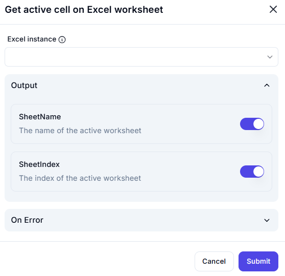

# Get Active Excel Worksheet Dialog

## Description

This dialog provides an interface to retrieve details about the currently active worksheet in a selected Excel instance. Users must choose an active Excel instance to fetch the worksheet name and index. The output provides structured data to identify the active worksheet.

## Fields and Options

### 1. **Excel Instance** 🛈

- A dropdown list where users can select an active Excel instance.
- Ensures that the correct Excel workbook is targeted for fetching worksheet details.

## Output

### 1. **SheetName**  

- Displays the name of the active worksheet.
- Useful for referencing the current sheet dynamically in automation.

### 2. **SheetIndex**  

- Returns the index of the active worksheet within the Excel workbook.
- Helps in scenarios where sheets are accessed programmatically by index.

## Use Cases

- Identifying the currently selected worksheet in an automation workflow.
- Referencing active worksheets dynamically in data processing tasks.
- Logging or tracking the active sheet before performing operations.
- Ensuring that automation actions are performed on the correct worksheet.

## Summary

The **Get Active Excel Worksheet** dialog enables users to retrieve the active worksheet's name and index from a selected Excel instance. This functionality is essential for dynamic spreadsheet operations, ensuring workflows interact with the correct sheet.
