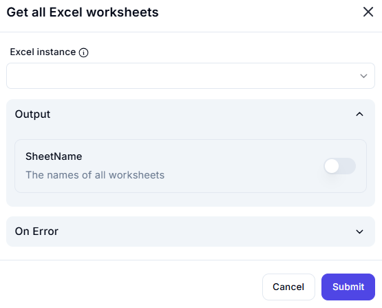

# Get All Excel Worksheets

## Description

This dialog provides an interface to retrieve the names of all worksheets within a selected Excel instance. Users must select an active Excel instance, and the output will include a list of all available worksheet names.

### 1. **Excel Instance** 🛈  

- A dropdown list where users can select an active Excel instance.  
- Ensures that worksheet retrieval is performed on the correct workbook.  

## Output  

### 1. **SheetName**  

- Returns the names of all worksheets within the selected Excel workbook.  
- This output is useful for dynamically referencing sheets in automation workflows.  

## Use Cases  

- Listing all available worksheets before performing data processing.  
- Automating operations across multiple worksheets in a workbook.  
- Providing users with sheet selection options based on available worksheets.  

## Summary  

The **Get All Excel Worksheets** dialog allows users to fetch the names of all worksheets from a selected Excel instance. This feature is useful for automating tasks that involve multiple sheets, ensuring workflows can dynamically interact with any worksheet in the workbook.  
