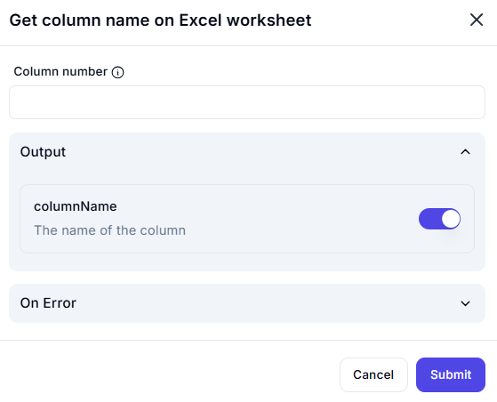

# Get Column Name on Excel Worksheet  

## Description

This feature allows users to retrieve the name of a column in an Excel worksheet based on its column number. It is useful for converting column numbers to their corresponding alphabetical names (e.g., `1` → `A`, `2` → `B`).  

  

## Fields and Options  

### 1. **Column Number** 🛈

- Enter the column number for which you want to retrieve the name (e.g., `1`, `2`, `27`).  

### 2. **Output: columnName** 🛈

- Retrieves the name of the column based on the provided column number (e.g., `A`, `B`, `AA`).  

## Use Cases

- Converting column numbers to names for use in formulas or scripts.  
- Dynamically referencing columns in automation workflows.  
- Logging or displaying column names for user-friendly outputs.  

## Summary

The **Get Column Name on Excel Worksheet** action provides a way to retrieve the name of a column based on its number. It ensures accurate and user-friendly column referencing in Excel automation workflows.  