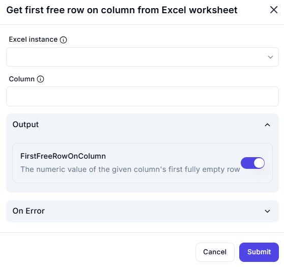

# Get First Free Row on Column from Excel Worksheet

## Description  

This dialog allows users to retrieve the first fully empty row within a specified column in an Excel worksheet. This is useful for identifying the next available row to insert data dynamically.

## Fields and Options  

### 1. **Excel Instance** 🛈

- A dropdown list to select the active Excel instance.  
- Ensures the operation is performed on the correct workbook.  

### 2. **Column** 🛈

- Specifies the column index where the search for the first empty row will be performed.  

### 3. **Output - FirstFreeRowOnColumn** 🛈

- Returns the numeric index of the first fully empty row in the specified column.  
- This helps in determining the next available row for data entry.  

## Use Cases  

- Identifying the next available row in a column for data entry automation.  
- Avoiding overwriting existing data by dynamically selecting empty rows.  
- Automating workflows where new data is appended to the first available row.  

## Summary  

The **Get First Free Row on Column from Excel Worksheet** feature helps users find the next available row in a given column, making it useful for automation, data entry, and workflow management.  
