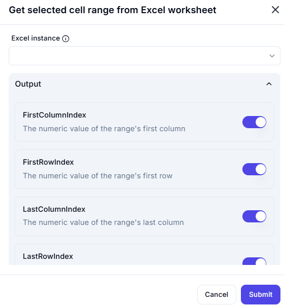

# Get Selected Cell Range from Excel Worksheet

## Description  

This dialog retrieves the numerical index values of the selected cell range in an Excel worksheet. It allows users to extract information about the first and last rows and columns of the selection.

## Fields and Options  

### 1. **Excel Instance** 🛈

- A dropdown list where users select the active Excel instance.  
- Ensures the action is performed on the correct workbook.  

### 2. **Output Section**
 
This section provides the output values for the selected cell range, each of which can be toggled on or off:  

- **FirstColumnIndex** 🛈  
  - The numeric value representing the first column of the selected range.  
- **FirstRowIndex** 🛈  
  - The numeric value representing the first row of the selected range.  
- **LastColumnIndex** 🛈  
  - The numeric value representing the last column of the selected range.  
- **LastRowIndex** 🛈  
  - The numeric value representing the last row of the selected range.  

## Use Cases  

- Extracting the dimensions of a selected range in Excel for automation or processing.  
- Dynamically identifying the selected range for further operations, such as formatting, copying, or data analysis.  
- Using the range values in other automation workflows to perform calculations or manipulations.  

## Summary  

The **Get Selected Cell Range from Excel Worksheet** dialog provides an interface to retrieve the numeric values of the first and last row and column indices of the selected range. These values can be used in various automation tasks, ensuring dynamic and efficient Excel operations.  
