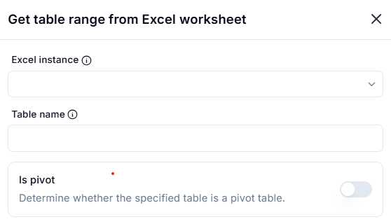
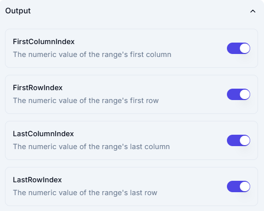

# Get Table Range from Excel Worksheet  

## Description

This feature allows users to retrieve the range of a specific table within an Excel worksheet. It can also determine whether the specified table is a pivot table.  

## Fields and Options  

### 1. **Excel Instance** 🛈

- A dropdown to select the active Excel instance.  
- Ensures the correct workbook is used for the operation.  

### 2. **Table Name** 🛈

- Specifies the name of the table from which the range needs to be retrieved.  
- The table must exist in the selected Excel instance.  

### 3. **Is Pivot (Optional)**

- A toggle option to determine whether the specified table is a pivot table.  
- When enabled, the system checks and confirms if the table is a pivot table.  

## Output

This feature provides four key outputs representing the numeric index of the table's range:  

1. **FirstColumnIndex**  
   - Returns the numeric index of the first column in the range.  

2. **FirstRowIndex**  
   - Returns the numeric index of the first row in the range.  

3. **LastColumnIndex**  
   - Returns the numeric index of the last column in the range.  

4. **LastRowIndex**  
   - Returns the numeric index of the last row in the range.  

## Use Cases

- Identifying the exact range of a specific table in an Excel sheet.  
- Validating if a table is a pivot table before performing further operations.  
- Automating data extraction from structured tables in Excel.  
- Using the table’s range dynamically for further processing.  

## Summary

The **Get Table Range from Excel Worksheet** feature helps users retrieve table ranges and determine pivot table status, streamlining data automation and analysis workflows.  
