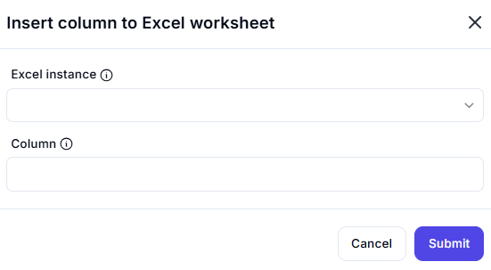

# Insert Column to Excel Worksheet

## Description  

This dialog allows users to insert a new column into an Excel worksheet at the specified column index. Once inserted, existing columns shift to the right.

## Fields and Options  

### 1. **Excel Instance** 🛈

- A dropdown list to select the active Excel instance.  
- Ensures the operation is performed on the correct workbook.  

### 2. **Column** 🛈

- Specifies the column index where the new column will be inserted.  
- All columns to the right of the specified index will shift right automatically.  

## Use Cases  

- Adding new data fields to an existing dataset.  
- Structuring worksheets dynamically by inserting necessary columns.  
- Automating data processing workflows in Excel.  

## Summary  

The **Insert Column to Excel Worksheet** dialog provides an efficient way to insert a new column at a specified position. This feature helps manage structured data dynamically within an Excel workbook.  
