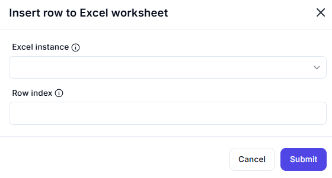

# Insert Row to Excel Worksheet

## Description  

This dialog allows users to insert a new row into an Excel worksheet at a specified row index.

## Fields and Options  

### 1. **Excel Instance** 🛈

- A dropdown list to select the active Excel instance.  
- Ensures the operation is performed on the correct workbook.  

### 2. **Row Index** 🛈

- Specifies the row index where the new row will be inserted.  
- Existing rows will be shifted down to accommodate the new row.  

## Use Cases  

- Adding a new row to an Excel sheet dynamically.  
- Inserting blank rows for data organization.  
- Preparing an Excel file for further data input.  

## Summary  

The **Insert Row to Excel Worksheet** dialog provides a simple interface for adding a new row at a specified index within an Excel sheet. This feature helps automate the insertion of blank rows in structured data workflows.  
