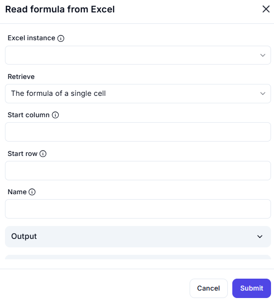

# Read Formula from Excel  

## Description  

This feature allows users to retrieve the formula from a specific cell in an Excel worksheet. It is useful for extracting, analyzing, or debugging formulas within a spreadsheet.  

  

## Fields and Options  

### 1. **Excel Instance** 🛈

- A dropdown to select the active Excel instance.  
- Ensures the correct workbook is used for the operation.  

### 2. **Retrieve** 🛈

- Defines the retrieval type. Options include:  
  - **The formula of a single cell** (default)  

### 3. **Start Column** 🛈

- Specifies the column index of the target cell containing the formula.  

### 4. **Start Row** 🛈

- Specifies the row index of the target cell.  

### 5. **Name** 🛈

- Optional field to name the retrieved formula result for reference.  

### 6. **Output**

- Displays the extracted formula from the specified cell.  

## Use Cases  

- Extracting formulas from cells for analysis.  
- Debugging Excel formulas in automation workflows.  
- Checking consistency in spreadsheet calculations.  

## Summary  

The **Read Formula from Excel** feature allows users to fetch the formula from a specific cell, making it useful for debugging, data validation, and automation workflows.
