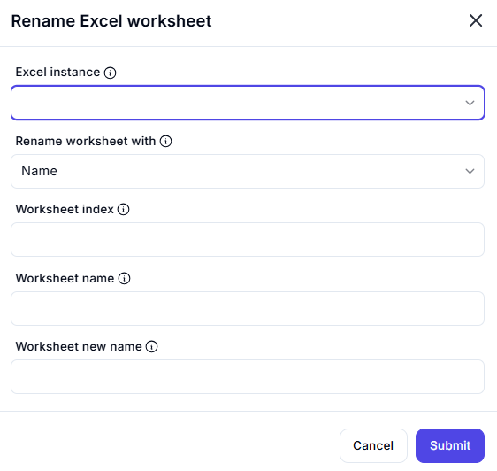

# Rename Excel Worksheet

## Description

This dialog allows users to rename a specific worksheet in an active Excel instance. Users can identify the worksheet by either its name or index and specify the new name for the sheet.

## Fields and Options

### 1. **Excel Instance** 🛈  

- A dropdown list where users select an active Excel instance.  
- Ensures that the renaming action is applied to the correct workbook.  

### 2. **Rename Worksheet With** 🛈  

- A dropdown allowing users to choose between renaming by **Name** or **Index**.  
- Selecting "Name" enables the **Worksheet Name** field.  
- Selecting "Index" enables the **Worksheet Index** field.  

### 3. **Worksheet Index** 🛈  

- A numeric input field for specifying the sheet index (if renaming by index is selected).  
- Indexing typically starts from `1`.  

### 4. **Worksheet Name** 🛈  

- A text input field for specifying the sheet name (if renaming by name is selected).  
- The name should match exactly as it appears in Excel.  

### 5. **Worksheet New Name** 🛈  

- A text input field where users enter the new name for the worksheet.  
- The new name must be unique within the workbook and should not contain invalid characters.  

## Use Cases  

- Updating worksheet names for better clarity and organization.  
- Standardizing sheet names for automated reporting.  
- Renaming sheets dynamically based on user input or data conditions.  

## Summary  

The **Rename Excel Worksheet** dialog provides a simple interface for renaming a worksheet within a selected Excel instance. Users can rename the sheet by specifying its name or index, ensuring flexibility in automation workflows.  
