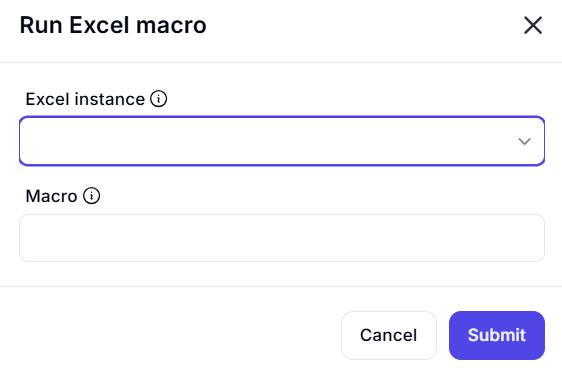

# Run Excel Macro Dialog

## Description

This dialog provides an interface to run macros in an open Excel workbook. Users must select an active Excel instance and specify the macro name they wish to execute. The dialog includes a simple and intuitive layout with fields for input and action buttons to submit or cancel the operation.

## Fields and Options

### 1. **Excel Instance** 🛈

- A dropdown list where users can select an active Excel instance.
- Ensures that the macro runs in the correct Excel workbook.

### 2. **Macro** 🛈

- A text input field where users specify the macro name to execute.
- The macro should already be defined in the selected Excel instance.

## Use Cases

- Automating financial reports in Excel.
- Running data validation scripts.
- Executing formatting macros to enhance spreadsheet appearance.
- Performing bulk data updates through automation.

## Summary

The **Run Excel Macro** dialog allows users to execute a predefined macro within a selected Excel instance. This feature is useful for automating repetitive tasks, performing complex calculations, and managing data efficiently.
