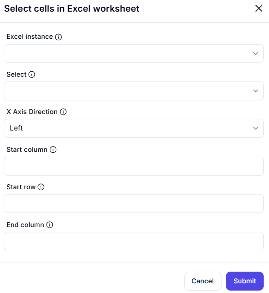

# Select Cells in Excel Worksheet

## Description

This dialog allows users to select a specific range of cells within an Excel worksheet. Users can define the start and end points of the selection, along with directional preferences for selection expansion.

## Fields and Options

### 1. **Excel Instance** 🛈  

- A dropdown list where users select an active Excel instance.  
- Ensures that the action is performed on the correct workbook.  

### 2. **Select** 🛈  

- A dropdown to specify the type of selection (e.g., single cell, range, entire row/column).  

### 3. **X Axis Direction** 🛈  

- A dropdown to determine the direction for selection expansion.  
- Options may include **Left, Right, Up, Down**.  

### 4. **Start Column** 🛈  

- A numeric input field for specifying the starting column of the selection.  
- Columns are usually numbered starting from `1`.  

### 5. **Start Row** 🛈  

- A numeric input field for specifying the starting row of the selection.  
- Rows are usually numbered starting from `1`.  

### 6. **End Column** 🛈  

- A numeric input field for specifying the ending column of the selection.  
- Helps in defining a selection range when multiple cells are chosen.  

## Use Cases  

- Selecting a specific range of cells for processing or data extraction.  
- Automating highlighting or formatting of specific cells.  
- Selecting data dynamically based on user-defined criteria.  

## Summary  

The **Select Cells in Excel Worksheet** dialog provides an interface for choosing a specific range of cells in an Excel worksheet. Users can define the starting and ending points, along with direction preferences, to automate cell selection efficiently.  
