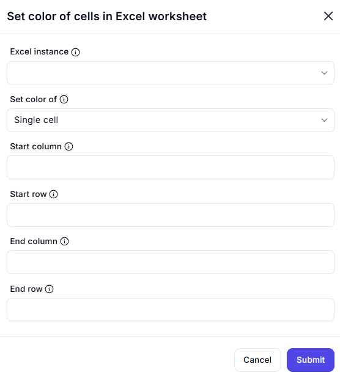

# Set Color of Cells in Excel Worksheet  

## Description

This feature allows users to change the background color of specific cells in an Excel worksheet. It supports setting the color for a **single cell** or a **range of cells** based on row and column indices.  

  

## Fields and Options  

### 1. **Excel Instance** 🛈

- A dropdown to select the active Excel instance.  
- Ensures the correct workbook is modified.  

### 2. **Set Color Of** 🛈

- Specifies whether to apply color to:  
  - **Single cell** (default)  
  - **Range of cells**  

### 3. **Start Column** 🛈

- The starting column index for the color application.  

### 4. **Start Row** 🛈

- The starting row index for the color application.  

### 5. **End Column** 🛈 *(Only applicable for range selection)*

- The ending column index for setting color in a range.  

### 6. **End Row** 🛈 *(Only applicable for range selection)*

- The ending row index for setting color in a range.  

## Use Cases

- Highlighting important data points in reports.  
- Marking overdue or completed tasks in a tracking sheet.  
- Differentiating data categories visually.  
- Improving readability of Excel dashboards.  

## Summary

The **Set Color of Cells in Excel Worksheet** feature provides an easy way to enhance Excel sheets with color coding. Users can apply formatting dynamically based on their needs.
