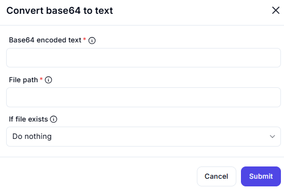

# Convert Base64 to Text

## Description

The **Convert Base64 to Text** action decodes Base64-encoded text and optionally saves the output to a file.

## Fields and Options  

### **1. Base64 Encoded Text** *(Required)* 🛈

- The input text that is Base64-encoded.
- This field must be filled with valid Base64 data to be decoded.

### **2. File Path** *(Required)* 🛈

- Specifies the destination file path where the decoded text will be saved.
- Ensure that the path is accessible and has appropriate write permissions.

### **3. If File Exists** *(Optional)* 🛈  

Defines what happens if the specified file already exists:

- **Do nothing** (default) → Leaves the existing file unchanged.
- **Overwrite existing content** → Replaces the file’s contents with the decoded text.
- **Append to existing file** → Adds the decoded text to the file without removing existing content.

## Use Cases  

- Decoding Base64-encoded data from APIs or encrypted storage.
- Converting encoded messages, files, or configuration data back to readable text.
- Storing decoded text into files for further processing.

## Important Notes  

- Ensure the provided Base64 input is valid, or decoding may fail.
- When saving to a file, verify file permissions to prevent access errors.

## Summary  

The **Convert Base64 to Text** action is useful for decoding Base64 strings and optionally saving the result into a file for further use.
