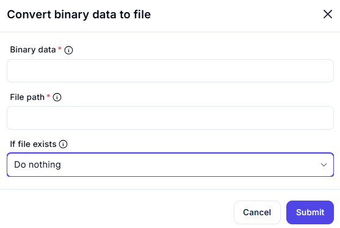

# Convert Binary Data to File

## Description  

The **Convert Binary Data to File** action takes binary data and writes it to a specified file.

## Fields and Options  

### **1. Binary Data** *(Required)* 🛈  

- The binary data to be written to the file.
- Ensure that the data is correctly formatted before processing.

### **2. File Path** *(Required)* 🛈  

- The location where the binary data should be saved as a file.
- Make sure the specified path is accessible.

### **3. If File Exists** *(Optional)*

- Determines what happens if a file with the same name already exists.
- Options include:
  - **Do nothing** (Default)
  - **Overwrite existing file**
  - **Append to file**

## Use Cases  

- Restoring binary data into a readable file format.
- Creating documents, images, or any file from binary storage.
- Saving files received from APIs or external systems.

## Important Notes  

- Ensure the binary data corresponds to the expected file type to avoid corruption.
- Choose an appropriate file path with proper permissions.
- Handling file overwrites carefully prevents accidental data loss.

## Summary  

The **Convert Binary Data to File** action allows users to take binary data and write it as a file, enabling smooth handling of file-based workflows.
