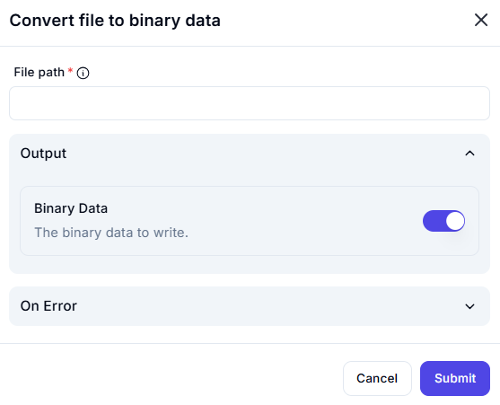

# Convert File to Binary Data

## Description

The **Convert File to Binary Data** action reads a file and converts its contents into a binary format.

## Fields and Options  

### **1. File Path** *(Required)* 🛈

- The path to the file that needs to be converted into binary format.
- Ensure the file exists and is accessible.

### **2. Output** *(Optional)*

- **Binary Data** *(Enabled by default)* → Converts the file’s contents into a binary data output.
- This binary data can be used for further processing, storage, or transmission.

### **3. On Error** *(Optional)*

- Defines the action to take if an error occurs during the conversion process.
- Options may include logging the error, stopping execution, or retrying.

## Use Cases

- Preparing files for storage in databases or cloud services that require binary formats.
- Encoding files for secure transmission or embedding into other data structures.
- Converting documents, images, or any file type into binary for processing in automation workflows.

## Important Notes

- Large files may require more processing time.
- Ensure proper handling of binary data to avoid corruption when saving or transmitting.
- The output binary data should be properly interpreted when used in subsequent steps.

## Summary

The **Convert File to Binary Data** action reads a file, extracts its binary contents, and makes it available for further use in workflows requiring binary data processing.
