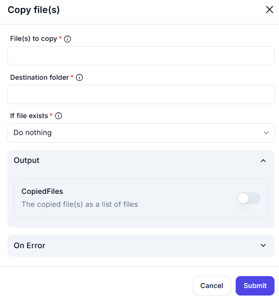

# Copy File(s)  

## Description  

The **Copy File(s)** action allows users to copy one or more files from a source location to a specified destination folder.  

  

## Fields and Options  

### 1. **File(s) to Copy** *(Required)* 🛈

- Specify the file(s) to be copied.  
- Multiple files can be selected.  

### 2. **Destination Folder** *(Required)* 🛈  

- Define the target folder where the copied file(s) should be stored.  

### 3. **If File Exists** *(Required)* 🛈  

- Choose how to handle cases where the file already exists in the destination folder:  
  - **Do nothing** – Skips the copy operation.  
  - **Overwrite** – Replaces the existing file.  
  - **Rename** – Creates a new file with a different name.  

### 4. **Output: CopiedFiles**  

- Returns a list of successfully copied files.  

## Use Cases  

- Backup important files to a different directory.  
- Organize files by moving copies to categorized folders.  
- Duplicate files before processing or modification.  

## Summary  

The **Copy File(s)** action provides a simple and efficient way to duplicate files to a specified location while handling potential filename conflicts.  
