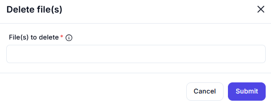

# Delete File(s)

## Description  

The **Delete File(s)** action allows users to remove one or more specified files from the system.

## Fields and Options  

### 1. **File(s) to Delete** *(Required)* 🛈

- Specify the file(s) to be deleted.  
- Multiple files can be selected.  

## Use Cases

- Automate file cleanup processes.  
- Remove temporary or obsolete files.  
- Free up storage space by deleting unnecessary files.  

## Important Notes

- **Deletion is permanent** – Ensure that the selected files are no longer needed before proceeding.  
- There is no built-in recovery option once files are deleted.  

## Summary

The **Delete File(s)** action is a simple yet powerful tool for managing file removal tasks. Users must exercise caution as deleted files cannot be recovered.
