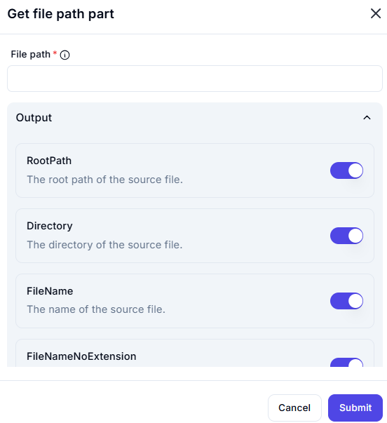

# Get File Path Part

## Description

The **Get File Path Part** action extracts specific components from a given file path.

## Fields and Options  

### 1. **File Path** *(Required)* 🛈

- The full path of the file from which parts need to be extracted.  

### 2. **Output Sections**

You can enable or disable specific parts of the file path to extract:

- **RootPath**  
  - Extracts the root path of the file (e.g., `C:\`, `/home/user/`).  

- **Directory**  
  - Retrieves the directory path containing the file.  
  - Example: If the file path is `/home/user/documents/file.txt`, the directory is `/home/user/documents/`.  

- **FileName**  
  - Extracts the full name of the file, including its extension.  
  - Example: `file.txt`.  

- **FileNameNoExtension**  
  - Extracts the filename without the extension.  
  - Example: If the file is `file.txt`, this will return `file`.  

## Use Cases

- Extracting directory paths for file organization.  
- Separating filenames from extensions for further processing.  
- Logging or displaying only relevant portions of file paths.  

## Important Notes

- Ensure the provided file path exists or is correctly formatted.  
- This function does not validate whether the file exists, only extracts parts from the path string.  

## Summary

The **Get File Path Part** action helps extract key components of a file path, making it useful for automation tasks that require file organization or metadata retrieval.
