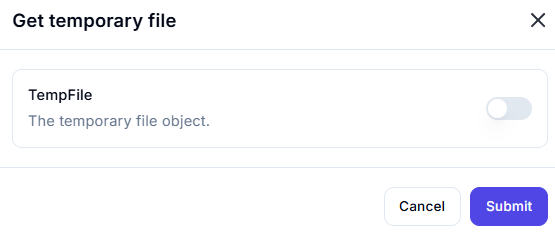

# Get Temporary File

## Description

The **Get Temporary File** action generates a temporary file object that can be used for intermediate storage.

## Fields and Options  

### **1. TempFile** *(Optional)* 🛈

- Enables or disables the creation of a temporary file object.
- If enabled, the system will generate a temporary file that can be used in workflows.

## Use Cases

- Storing temporary data during automation processes.
- Holding intermediate results before saving them permanently.
- Creating temporary files for testing or debugging.

## Important Notes

- Temporary files are usually deleted once the workflow execution ends.
- Ensure to move or save important data elsewhere if persistence is required.

## Summary

The **Get Temporary File** action provides a temporary file object that can be used within a workflow for short-term storage and processing.
