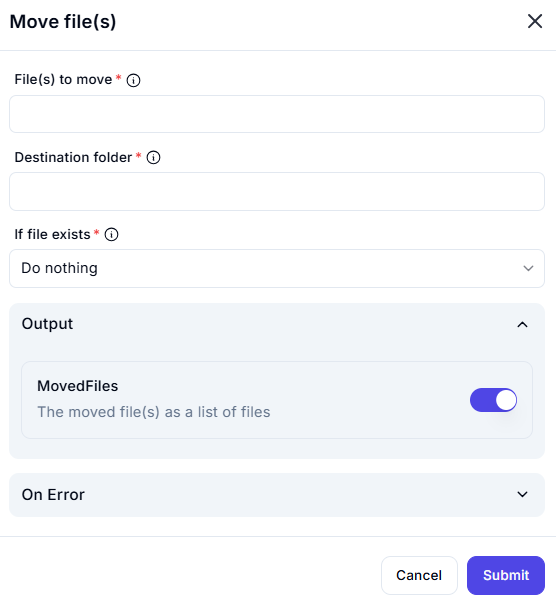

# Move File(s)  

## Description  

The **Move File(s)** action allows users to move one or more files from a source location to a specified destination folder.  

  

## Fields and Options  

### 1. **File(s) to Move** *(Required)* 🛈  

- Specify the file(s) that should be moved.  
- Multiple files can be selected.  

### 2. **Destination Folder** *(Required)* 🛈

- Define the target folder where the selected file(s) should be moved.  

### 3. **If File Exists** *(Required)* 🛈

- Choose what should happen if a file with the same name already exists in the destination folder:  
  - **Do nothing** – Skips the move operation.  
  - **Overwrite** – Replaces the existing file.  
  - **Rename** – Moves the file but assigns a different name to avoid conflicts.  

### 4. **Output: MovedFiles**

- Returns a list of successfully moved files.  

## Use Cases

- Organize files by moving them to appropriate directories.  
- Automate file management by transferring files to archive folders.  
- Relocate processed files to a different directory.  

## Summary

The **Move File(s)** action helps efficiently transfer files from one location to another while handling potential filename conflicts.  
