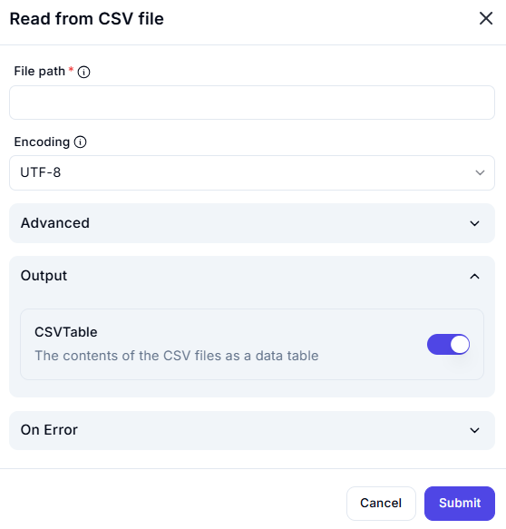

# Read from CSV File

## Description

The **Read from CSV File** action allows users to extract data from a CSV file and store it as a structured data table.

## Fields and Options  

### 1. **File Path** *(Required)* 🛈

- Specify the full file path of the CSV file to be read.  
- The file must be accessible from the specified location.  

### 2. **Encoding** *(Optional)* 🛈

- Defines the character encoding used to read the file.  
- Default: **UTF-8** (recommended for most cases).  
- Other options include ASCII, ISO-8859-1, etc.  

### 3. **Advanced** *(Optional)*

- This section may contain additional settings, such as delimiter selection and header row inclusion (if available in the tool).  

### 4. **Output** *(Required)*

- **CSVTable** (Enabled by default)  
  - Stores the contents of the CSV file as a structured data table.  
  - This allows for further processing, filtering, and transformation of data.  

### 5. **On Error** *(Optional)*

- Defines how errors should be handled if the file cannot be read.  
- Options may include logging errors or stopping execution (if applicable in the tool).  

## Use Cases

- Importing tabular data for further processing.  
- Extracting structured data from a CSV file for automation or reporting.  
- Transforming CSV data into a format compatible with databases or APIs.  

## Important Notes

- Ensure that the file path is correctly specified to avoid errors.  
- The selected encoding should match the CSV file’s encoding to prevent character corruption.  
- Large CSV files may take longer to process.  

## Summary

The **Read from CSV File** action is a powerful tool for extracting and processing structured data efficiently.
