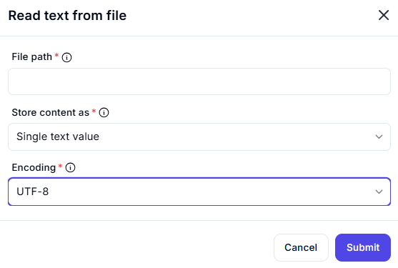

# Read Text from File

## Description

The **Read Text from File** action allows users to extract text content from a specified file and store it as a text variable.

## Fields and Options  

### 1. **File Path** *(Required)* 🛈

- Specify the file path from which text should be read.  
- The file must be accessible and contain readable text data.  

### 2. **Store Content As** *(Required)* 🛈

- Determines how the text content is stored. Options include:  
  - **Single text value** – Stores all content as a single string.  
  - **List of lines** – Splits content into a list, where each item represents a line.  

### 3. **Encoding** *(Required)* 🛈

- Defines the character encoding used to read the file.  
- Default: **UTF-8** (recommended for most cases).  
- Other options include ASCII, ISO-8859-1, etc.  

## Use Cases

- Extracting and processing text from log files, reports, or documents.  
- Reading structured data stored in plain text files.  
- Automating file reading in data processing workflows.  

## Important Notes

- Ensure the correct **file path** is provided to avoid errors.  
- Selecting the correct **encoding** is crucial for proper text interpretation.  
- For large files, consider performance impacts when storing as a **single text value**.  

## Summary

The **Read Text from File** action is a useful tool for reading and processing text-based file content efficiently.
