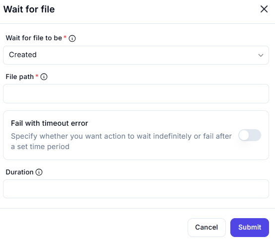

# Wait for File  

## Description

This feature allows users to wait for a file to be created at a specified path. It includes options to set a timeout or wait indefinitely, ensuring flexibility in automation workflows.  

  

## Fields and Options  

### 1. **Wait for File to Be** 🛈

- **Description**: Choose the condition to wait for:  
  - **Created**: Wait for the file to be created at the specified path.  
- **Purpose**: This ensures the correct condition is monitored.  

### 2. **File Path** 🛈

- **Description**: Enter the full path of the file to wait for (e.g., `C:\Documents\example.txt`).  
- **Purpose**: This ensures the correct file is monitored for creation.  

### 3. **Fall with Timeout Error** 🛈

- **Description**: Specify whether the action should wait indefinitely or fail after a set time period:  
  - **Enabled**: Fail after the specified duration.  
  - **Disabled**: Wait indefinitely for the file to be created.  
- **Purpose**: This ensures the action behaves as expected based on the workflow requirements.  

### 4. **Duration** 🛈

- **Description**: Set the maximum time (in seconds) to wait for the file to be created (if timeout is enabled).  
- **Purpose**: This ensures the action fails gracefully if the file is not created within the specified time.

## Use Cases

- **File Monitoring**: Waiting for a file to be created before proceeding with further actions.  
- **Workflow Synchronization**: Ensuring a file is available before processing it.  
- **Error Handling**: Preventing indefinite waits by setting a timeout for file creation.  

## Summary

The **Wait for File** action provides a way to wait for a file to be created at a specified path, with options to set a timeout or wait indefinitely. It ensures reliable synchronization and error handling in automation workflows involving file operations.
