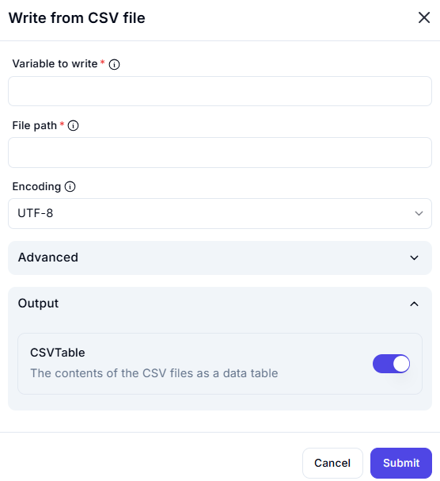

# Write from CSV File

## Description

The **Write from CSV File** action allows users to export structured data from a variable into a CSV file.

## Fields and Options  

### 1. **Variable to Write** *(Required)* 🛈

- The variable containing the data to be written to the CSV file.  
- The variable must be in a structured format compatible with CSV, such as a table or list of dictionaries.  

### 2. **File Path** *(Required)* 🛈

- The full file path where the CSV file will be saved.  
- If the file already exists, behavior depends on advanced settings (if available).  

### 3. **Encoding** *(Optional)* 🛈

- Defines the character encoding used when writing the file.  
- Default: **UTF-8** (recommended for most cases).  
- Other options include ASCII, ISO-8859-1, etc.  

### 4. **Advanced** *(Optional)*

- This section may include options such as delimiter selection, append vs. overwrite, and header row settings.  

### 5. **Output** *(Optional)*

- **CSVTable** (Enabled by default)  
  - Stores the newly written CSV contents as a structured data table.  
  - This allows further processing or validation after writing.  

### 6. **On Error** *(Optional)*

- Defines how errors should be handled if the write operation fails.  
- Options may include logging errors or stopping execution (if applicable in the tool).  

## Use Cases

- Exporting processed data into a CSV file for reporting or further analysis.  
- Saving structured data for integration with other applications or databases.  
- Automating data logging and storage processes.  

## Important Notes

- Ensure the variable to write is in a format suitable for CSV output.  
- Verify file path permissions to prevent write failures.  
- Large datasets may take longer to write.  

## Summary

The **Write from CSV File** action provides a simple and effective way to export structured data into a CSV format for easy sharing, storage, or further processing.
