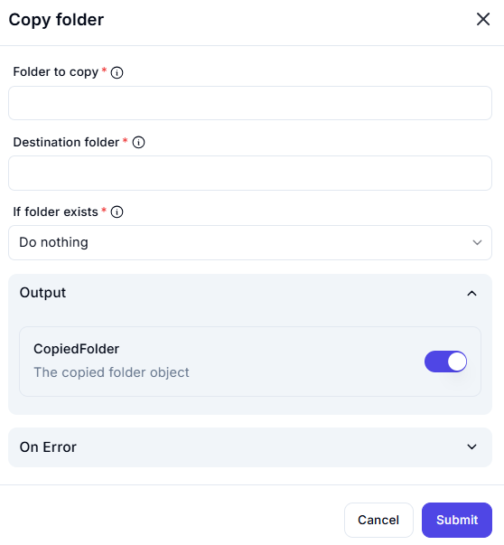

# Copy Folder

## Description

The **Copy Folder** action duplicates a specified folder and its contents to a destination folder.

## Fields and Options  

### **1. Folder to Copy** *(Required)* 🛈

- Specify the full path of the folder that should be copied.

### **2. Destination Folder** *(Required)* 🛈

- Define the full path where the copied folder should be placed.

### **3. If Folder Exists** *(Required)* 🛈

- Choose what happens if the destination folder already exists:
  - **Do nothing** (default): The copy action will not proceed.
  - **Replace existing folder**: The destination folder will be overwritten.
  - **Merge contents**: The contents of the copied folder will be added to the existing folder.

### **4. Output**

- **CopiedFolder**: Returns details of the copied folder object.

### **5. On Error** *(Optional)*

- Define an action to take if an error occurs (e.g., folder not found, permission denied).

## Use Cases

- Creating backups of folders.
- Duplicating project directories for testing.
- Transferring folder structures between locations.

## Important Notes

- Ensure the destination folder has sufficient space.
- If **Replace existing folder** is selected, the destination's existing contents may be lost.
- Copying large folders may take significant time.

## Summary

The **Copy Folder** action is essential for duplicating directory structures while offering flexibility in handling existing destination folders.
