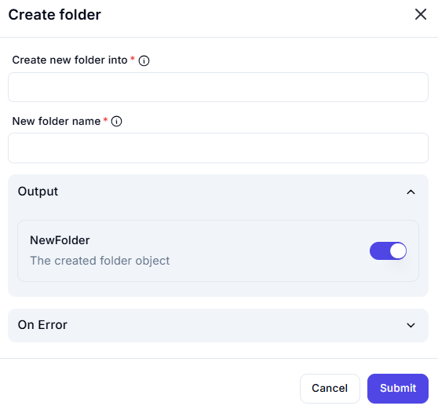

# Create Folder

## Description

The **Create Folder** action generates a new folder within a specified directory.

## Fields and Options  

### **1. Create New Folder Into** *(Required)* 🛈

- The parent directory where the new folder will be created.
- Must be a valid folder path.

### **2. New Folder Name** *(Required)* 🛈

- The name of the new folder.
- Avoid special characters or restricted names based on the operating system.

### **3. Output**

- **NewFolder** *(Folder Object Output)*  
  - Returns the newly created folder as an object.

### **4. On Error** *(Optional)*

- Defines the action to take in case of an error.

## Use Cases

- Automating folder creation for project structures.
- Ensuring required directories exist before saving files.
- Organizing file storage dynamically.

## Important Notes

- Ensure the parent folder exists before execution.
- Avoid using special characters in folder names.
- Handle potential errors if the folder already exists.

## Summary

The **Create Folder** action allows users to generate new directories dynamically within a specified location, ensuring structured file management.
