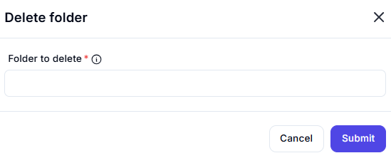

# Delete Folder

## Description

The **Delete Folder** action permanently removes a specified folder from the system.

## Fields and Options  

### **1. Folder to Delete** *(Required)* 🛈

- Specify the full path of the folder to delete.
- Ensure the folder exists before execution.

### **2. On Error** *(Optional)*

- Define the action to take if an error occurs (e.g., folder not found).

## Use Cases

- Automating cleanup processes by deleting unnecessary folders.
- Removing temporary or outdated directories.
- Managing storage space efficiently.

## Important Notes

- **Deletion is irreversible**—ensure the folder is no longer needed.
- The action may fail if the folder contains files and permissions restrict deletion.
- If a folder is in use, deletion may not be possible.

## Summary

The **Delete Folder** action helps automate folder removal tasks, ensuring efficient file system management.
