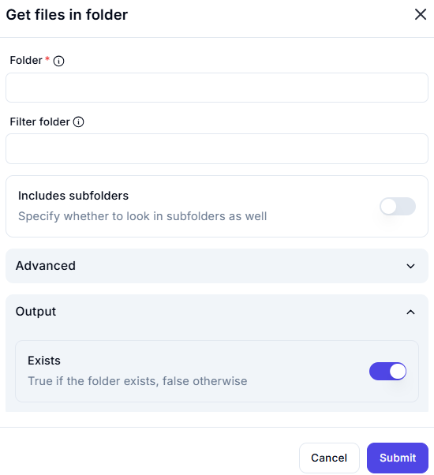

# Get Files in Folder

## Description

The **Get Files in Folder** action retrieves a list of files from a specified directory. It allows filtering and optional subfolder inclusion.

## Fields and Options  

### **1. Folder** *(Required)* 🛈

- The directory from which files will be retrieved.
- Must be a valid folder path.

### **2. Filter Folder** *(Optional)* 🛈

- A filter for retrieving specific files.
- Supports wildcard patterns like `*.txt` for filtering.

### **3. Includes Subfolders** *(Optional Toggle)*

- Enables or disables searching within subdirectories.
- **Off (default):** Only retrieves files from the main directory.
- **On:** Recursively searches subfolders.

### **4. Advanced Options**

- Additional configurations can be included if necessary.

### **5. Output**

- **Exists** *(Boolean Output)*  
  - `True` if the folder exists.  
  - `False` if the folder does not exist.  

## Use Cases

- Listing files in a directory for further processing.
- Filtering files based on extensions or naming patterns.
- Automating workflows that depend on folder content.

## Important Notes

- Ensure the specified folder exists before execution.
- Use filtering wisely to avoid retrieving too many files.
- Enable **Includes Subfolders** for recursive file searches.

## Summary

The **Get Files in Folder** action retrieves files from a given directory, with optional filtering and subfolder inclusion. It is useful for automating file-related tasks.
