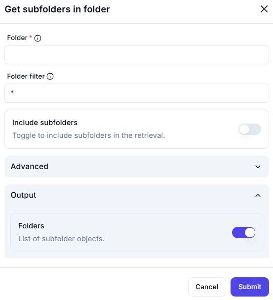

# Get Subfolders in Folder

## Description

The **Get Subfolders in Folder** action retrieves a list of subdirectories within a specified folder. It allows filtering and optional recursive search.

## Fields and Options  

### **1. Folder** *(Required)* 🛈

- The parent directory where subfolders will be searched.
- Must be a valid folder path.

### **2. Folder Filter** *(Optional)* 🛈

- A filter to specify which subfolders to retrieve.
- Supports wildcard patterns like `*` (all subfolders) or `Project*` (subfolders starting with "Project").

### **3. Include Subfolders** *(Optional Toggle)*

- Enables or disables recursive search in nested directories.
- **Off (default):** Retrieves only immediate subfolders.
- **On:** Recursively includes subfolders.

### **4. Advanced Options**

- Additional configurations if needed.

### **5. Output**

- **Folders** *(List Output)*  
  - Returns a list of subfolder objects found in the specified directory.

## Use Cases

- Retrieving a structured list of subdirectories.
- Filtering and selecting specific subfolders for automation tasks.
- Checking for the existence of subfolders before performing file operations.

## Important Notes

- Ensure the specified folder exists before execution.
- Use filtering to refine results and improve performance.
- Enable **Include Subfolders** to get all nested directories.

## Summary

The **Get Subfolders in Folder** action retrieves a list of subdirectories within a given directory. It supports filtering and optional recursive search for efficient folder management.
