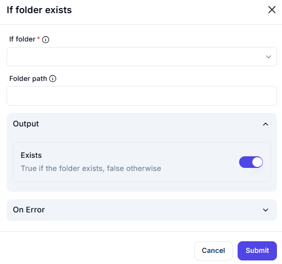

# If Folder Exists

## Description

The **If Folder Exists** action checks whether a specified folder exists at a given path and returns a boolean value.

## Fields and Options  

### **1. If Folder** *(Required)* 🛈

- The condition to check for folder existence.
- Ensures that the workflow proceeds based on the folder's availability.

### **2. Folder Path** *(Optional)* 🛈

- The directory path to check.
- Must be correctly formatted and accessible.

### **3. Output**

- **Exists** *(Boolean Output)*
  - `True` if the folder exists.  
  - `False` if the folder does not exist.

### **4. On Error** *(Optional)*

- Defines the action to take if an error occurs, such as an invalid path.

## Use Cases

- Ensuring a folder exists before performing file operations.
- Validating directory structure in an automation workflow.
- Conditional logic for creating new directories if they don’t exist.

## Important Notes

- Ensure the provided folder path is correctly formatted.
- Handle errors gracefully to prevent workflow failures.
- Consider adding a step to create the folder if it does not exist.

## Summary

The **If Folder Exists** action verifies whether a folder exists and outputs a boolean result. It is useful for conditional file management and directory validation.
