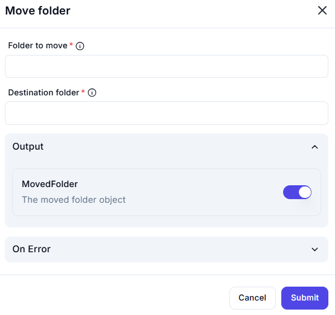

# Move Folder

## Description

The **Move Folder** action transfers a specified folder from one location to another.

## Fields and Options  

### **1. Folder to Move** *(Required)* 🛈

- Specify the full path of the folder that should be moved.

### **2. Destination Folder** *(Required)* 🛈

- Define the full path where the folder should be moved.

### **3. Output**

- **MovedFolder**: Returns details of the moved folder object.

### **4. On Error** *(Optional)*

- Define an action to take if an error occurs (e.g., folder not found, permission denied).

## Use Cases

- Organizing project folders.
- Relocating files between directories.
- Moving temporary data to permanent storage.

## Important Notes

- Ensure you have the necessary permissions for both source and destination.
- If a folder with the same name exists in the destination, the move might fail or overwrite existing data.
- Moving large folders might take time, depending on the file system.

## Summary

The **Move Folder** action is useful for reorganizing folder structures efficiently.
