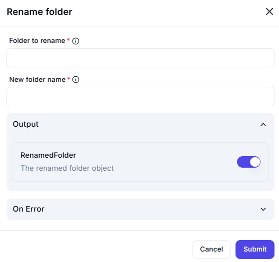

# Rename Folder

## Description

The **Rename Folder** action allows you to change the name of an existing folder.

## Fields and Options  

### **1. Folder to Rename** *(Required)* 🛈

- Specify the full path of the folder that you want to rename.

### **2. New Folder Name** *(Required)* 🛈

- Enter the new name for the folder.

### **3. Output**

- **RenamedFolder**: Returns details of the renamed folder object.

### **4. On Error** *(Optional)*

- Define an action to take if an error occurs (e.g., folder not found, permission denied, name conflict).

## Use Cases

- Standardizing folder names.
- Updating project folder names.
- Correcting naming conventions.

## Important Notes

- Ensure that the new folder name does not already exist in the same directory.
- The folder's location remains unchanged; only the name is updated.
- Necessary permissions are required to rename a folder.

## Summary

The **Rename Folder** action is useful for modifying folder names while maintaining their content and structure.
