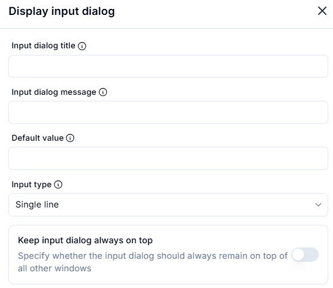
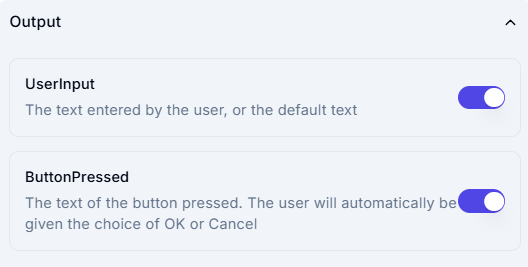

# Display Input Dialog

## Description

This section allows users to configure and display an input dialog box.

### **Input Dialog Settings**

- **Input dialog title**: (Optional) Title of the input dialog box.
- **Input dialog message**: (Optional) Message or instruction for the user.
- **Default value**: (Optional) Pre-filled default value in the input field.
- **Input type**: Select the type of input (Single line, Multi-line, Password, etc.).

### **Advanced Settings**

- **Keep input dialog always on top**: If enabled, the input dialog remains on top of all other windows.

When executed, the input dialog box will appear with the specified settings, allowing the user to enter text.

### **Output Fields**

- **UserInput (Enabled)**

Captures the text entered by the user in the input dialog.
If the user does not modify the input, the default text (if provided) is captured.

- **ButtonPressed (Enabled)**

Stores the text of the button pressed (e.g., "OK" or "Cancel").
The user is automatically presented with these button choices.
