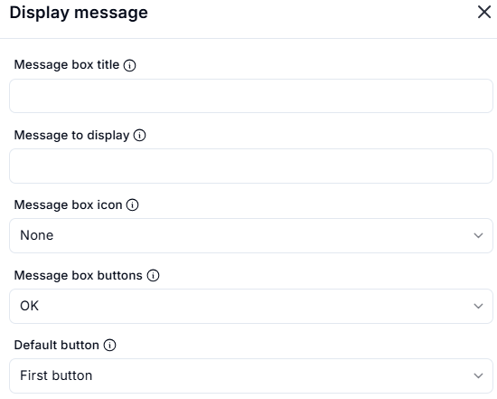
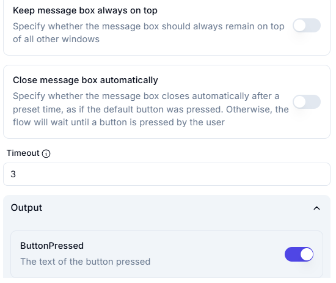

# Display Message

## Description

This section allows users to configure and display a message box.

### **Message Box Settings**

- **Message box title**: (Optional) Title of the message box.
- **Message to display**: (Optional) The text message to be shown in the box.
- **Message box icon**: Select an icon (None, Information, Warning, Error, etc.).
- **Message box buttons**: Choose the type of buttons (OK, Yes/No, Retry/Cancel, etc.).
- **Default button**: Select which button is the default option.

### **Advanced Settings**

- **Keep message box always on top**: Enable to keep the message box above all other windows.
- **Close message box automatically**: If enabled, the message box closes after a timeout, simulating the default button being pressed.
- **Timeout**: Set a delay (in seconds) before the message box closes automatically.

### **Output**

- **ButtonPressed**: Returns the text of the button pressed.

The message box will appear with the specified settings when executed.
