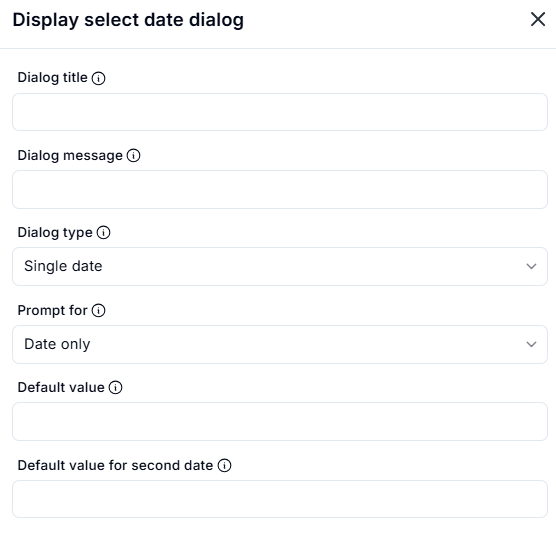
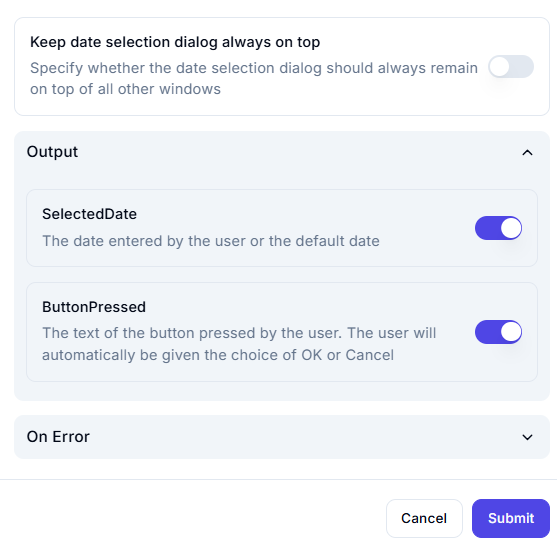

# Display Select Date Dialog

## Description

This configuration allows a user to pick a date or date range.

## **Key Fields**

1. **Dialog Title**

   - The title of the date selection dialog box.  

2. **Dialog Message**  
   - A message to guide the user on what to select.  

3. **Dialog Type**  
   - Specifies whether the user selects:  
     - **Single date** (one date)  
     - **Date range** (start and end dates)  

4. **Prompt For**  
   - Defines whether the user selects:  
     - **Date only** (just a calendar date)  
     - **Date and time** (includes hours and minutes)  

5. **Default Value**  
   - A pre-selected date when the dialog opens.  

6. **Default Value for Second Date**  
   - (For date range selection) A pre-selected second date.

## **Output Settings**

1. **SelectedDate**  
   - Stores the date entered by the user or the default date.  

2. **ButtonPressed**  
   - Captures the text of the button pressed by the user.  
   - The user is given the choice of **OK** or **Cancel** automatically.  
