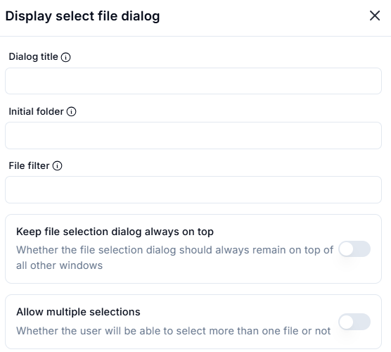
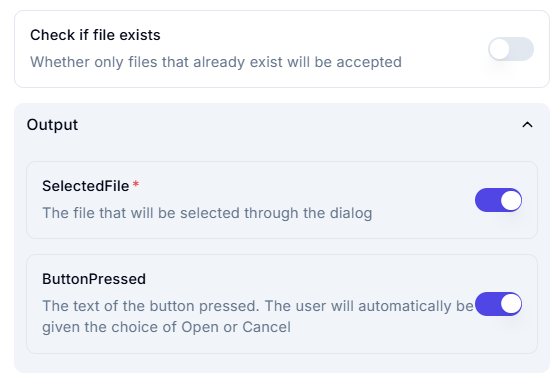

# Display Select File Dialog

## **Settings**

- **Dialog Title**  
  _(User-defined title for the file selection dialog)_

- **Initial Folder**  
  _(The starting folder when the dialog opens)_

- **File Filter**  
  _(Defines which file types are visible in the selection window)_

## **Options**

- **Keep file selection dialog always on top** 🔘  
  _(Whether the dialog remains on top of all windows)_  

- **Allow multiple selections** 🔘  
  _(Enable users to select multiple files at once)_

- **Check if file exists** 🔘  
  _(Only allows selecting files that already exist)_

## **Output**

- **SelectedFile** ✅  
  _(The file that will be selected through the dialog)_

- **ButtonPressed** ✅  
  _(The text of the button pressed. The user will be given the choice of Open or Cancel)_
