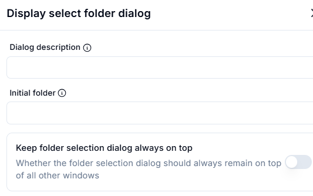
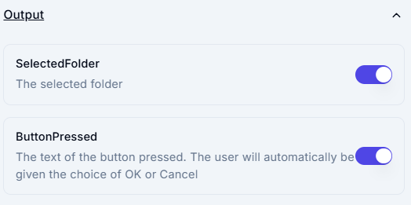

# Display Select Folder Dialog

## Description

This screenshot demonstrates an interface for displaying a folder selection dialog to the user. Users can configure the dialog description, initial folder, and whether the dialog should remain on top of all other windows.

---

## Configuration

### Dialog Description

- **Field**: Enter a description or title for the folder selection dialog (e.g., `Select a folder to save files`).

### Initial Folder

- **Field**: Specify the initial folder that the dialog should display when opened (e.g., `C:\Documents`).

### Keep Folder Selection Dialog Always on Top

- **Option**: Enable this option to ensure the folder selection dialog remains on top of all other windows.

## Output

### SelectedFolder

- **Description**: The folder selected by the user in the dialog.

### ButtonPressed

- **Description**: The text of the button pressed by the user (e.g., `OK` or `Cancel`).

---

## Example: Input and Output

### Scenario

You displayed a folder selection dialog to the user with the following settings:

- **Dialog Description**: `Select a folder to save files`.
- **Initial Folder**: `C:\Documents`.
- **Keep Dialog on Top**: Enabled.

The user selects the folder `C:\Documents\Projects` and clicks `OK`.

---

### Example Output

- **SelectedFolder**:
C:\Documents\Projects

- **ButtonPressed**:
OK

---

## Summary

This tool provides the results of the folder selection dialog, including the selected folder and the button pressed by the user. It is useful for capturing user input in file management workflows and determining the next steps based on the user's choice.
