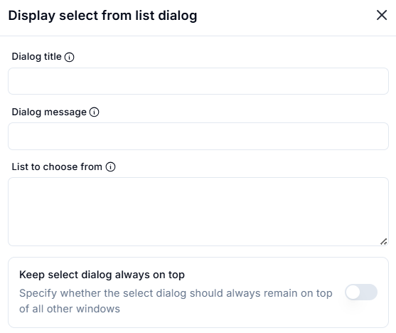
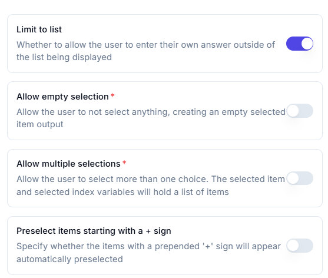
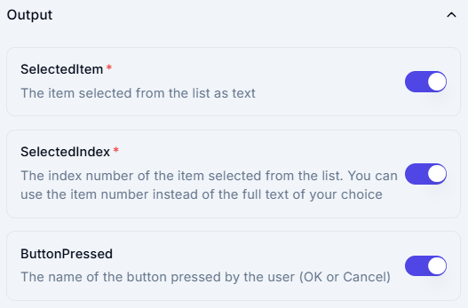

# Display Select Date Dialog

## Description

This configuration allows a user to pick a date or date range.

## **Key Fields**

1. **Dialog Title**  
   - The title of the date selection dialog box.  

2. **Dialog Message**  
   - A message to guide the user on what to select.  

## **Settings**

1. **Limit to List**
   - Allows the user to enter their own answer outside of the displayed list.  

2. **Allow Empty Selection**
   - If enabled, the user can leave the selection empty.  

3. **Allow Multiple Selections**
   - If enabled, the user can select multiple choices.  
   - Selected item and index variables will hold a list of items.  

4. **Preselect Items Starting with a `+` Sign**
   - Automatically preselects items that have a `+` sign at the beginning.  

## **Output**

1. **SelectedItem** ✅  
   - The item selected from the list as text.  

2. **SelectedIndex** ✅  
   - The index number of the selected item.  
   - Can be used instead of the full text of the selected choice.  

3. **ButtonPressed** ✅  
   - The name of the button pressed by the user (OK or Cancel).  
