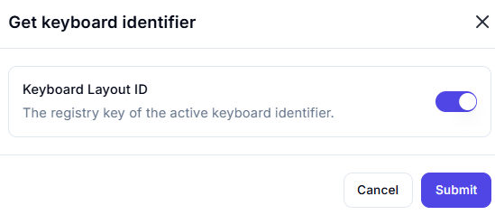

# Get Keyboard Identifier  

## Description

This feature allows users to retrieve the identifier of the active keyboard layout. It is useful for identifying the current keyboard layout in use, which can be important for localization or input-related automation tasks.  

  

## Fields and Options  

### 1. **Keyboard Layout ID** 🛈

- **Description**: Retrieves the registry key of the active keyboard identifier.  
- **Purpose**: This provides the identifier of the current keyboard layout for further use in the workflow.  

## Use Cases

- **Localization**: Identifying the current keyboard layout for localization purposes.  
- **Input Automation**: Ensuring the correct keyboard layout is used for input-related tasks.  
- **System Configuration**: Retrieving keyboard layout information for system configuration or reporting.  

## Summary

The **Get Keyboard Identifier** action provides a way to retrieve the identifier of the active keyboard layout. It ensures accurate identification of the keyboard layout, making it ideal for workflows involving localization, input automation, or system configuration.
