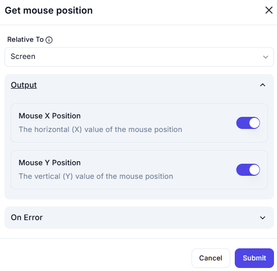

# Get Mouse Position

## Description

The **Get Mouse Position** action retrieves the current position of the mouse cursor relative to a specified reference point.

## Fields and Options  

### **1. Relative To** *(Required)* 🛈

- Defines the reference point for mouse position measurement.
- Options:
  - **Screen** (default): Retrieves the cursor's position relative to the entire screen.
  - **Window**: Retrieves the cursor's position relative to the active window.
  - **Element**: Retrieves the cursor's position relative to a specific UI element.

### **2. Output**

- **Mouse X Position**: Returns the horizontal (X) coordinate of the mouse.  
- **Mouse Y Position**: Returns the vertical (Y) coordinate of the mouse.  

### **3. On Error** *(Optional)*

- Defines an action to take if an error occurs (e.g., unable to detect cursor position).

## Use Cases

- Tracking user interaction for analytics.  
- Implementing custom cursor-based actions.  
- Automating UI workflows that depend on mouse position.

## Important Notes

- Ensure the reference frame is correctly set to get accurate coordinates.  
- This action does not track movement over time, only capturing a snapshot of the current position.

## Summary

The **Get Mouse Position** action is useful for detecting cursor location in automation and interaction tracking.
