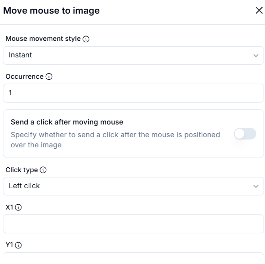

# Move Mouse to Image

## Description

The **Move Mouse to Image** action moves the mouse pointer to a specific image on the screen and optionally performs a click action.

## Fields and Options  

### **1. Mouse Movement Style** *(Required)* 🛈

- Determines how the mouse moves to the detected image position.
- Options:
  - **Instant** (default) – Moves the mouse immediately to the image.
  - **Smooth** – Moves the mouse gradually for a more natural effect.

### **2. Occurrence** *(Required)* 🛈

- Specifies which occurrence of the image should be targeted (if there are multiple matches on the screen).
- Default: **1** (first occurrence).

### **3. Send a Click After Moving Mouse** *(Optional)* 🛈

- When enabled, the action will automatically click on the detected image location after moving the mouse.

### **4. Click Type** *(Required if click is enabled)* 🛈

- Defines the type of click to perform after moving the mouse.
- Options:
  - **Left Click** (default)
  - **Right Click**
  - **Double Click**
  - **Middle Click**

### **5. X1 & Y1 Coordinates** *(Optional)* 🛈

- Defines the exact pixel offset within the detected image where the mouse should move.

## Use Cases

- Automating interactions with UI elements that may not have unique selectors.
- Clicking buttons or elements that are image-based (e.g., game automation).
- Testing applications where elements may change dynamically.

## Important Notes

- Ensure the reference image is clear and not distorted.
- Image recognition may fail if the UI changes significantly.
- The accuracy of detection depends on screen resolution and scaling settings.

## Summary

The **Move Mouse to Image** action allows automated cursor movement and optional clicking based on image recognition.
