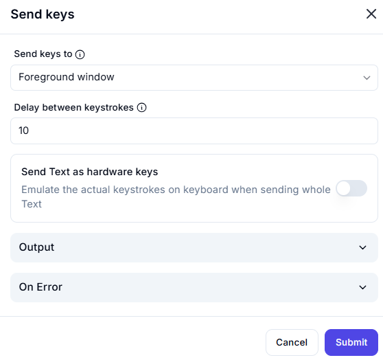

# Send Keys  

## Description

This feature allows users to send keystrokes or text to the foreground window. It includes options to control the delay between keystrokes and emulate hardware keys for accurate input simulation.  

  

## Fields and Options  

### 1. **Send Keys To** 🛈

- **Description**: Choose the target for sending keystrokes:  
  - **Foreground Window**: Send keystrokes to the currently active window.  
- **Purpose**: This ensures the keystrokes are sent to the correct window.  

### 2. **Delay Between Keystrokes** 🛈

- **Description**: Set the delay (in milliseconds) between each keystroke (e.g., `10` ms).  
- **Purpose**: This controls the speed of keystroke simulation for accurate input.  

### 3. **Send Text as Hardware Keys** 🛈

- **Description**: Choose whether to emulate actual keystrokes on the keyboard when sending text:  
  - **Enabled**: Emulate hardware keystrokes for accurate input simulation.  
  - **Disabled**: Send text as a single input without emulating keystrokes.  
- **Purpose**: This ensures compatibility with applications that require hardware-level input.  

### 4. **Output** 🛈

- **Description**: Retrieve the result of the keystroke action (if applicable).  
- **Purpose**: This provides feedback or results for further use in the workflow.  

### 5. **On Error**

- **Description**: Define how errors should be handled during execution (e.g., fail, retry, ignore).  
- **Purpose**: This ensures proper error handling in case the keystroke action fails.

## Use Cases

- **Input Simulation**: Simulating user input in applications or forms.  
- **Automating Typing**: Automating text entry in software that requires hardware-level input.  
- **Workflow Integration**: Including keystroke simulation as part of larger automation workflows.  

## Summary

The **Send Keys** action provides a way to send keystrokes or text to the foreground window, with options to control the delay between keystrokes and emulate hardware keys. It ensures accurate and reliable input simulation, making it ideal for automating user interactions in applications.
