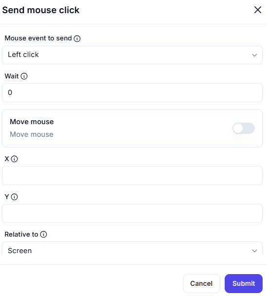

# Send Mouse Click

## Description

The **Send Mouse Click** action simulates a mouse click at a specified position on the screen.

## Fields and Options  

### **1. Mouse Event to Send** *(Required)* 🛈

- Defines the type of mouse click event to execute.  
- Options:
  - **Left Click** (default)
  - **Right Click**
  - **Double Click**
  - **Middle Click**

### **2. Wait** *(Optional)* 🛈

- Sets a delay (in seconds) before executing the click.  
- Default: **0** (no wait time).  

### **3. Move Mouse** *(Optional)* 🛈

- When enabled, moves the mouse to the specified X, Y coordinates before clicking.

### **4. X & Y Coordinates** *(Optional)* 🛈

- Defines the exact screen position where the mouse click should occur.  
- If left empty, the click happens at the current mouse position.

### **5. Relative To** *(Required)* 🛈

- Defines the reference point for the X and Y coordinates.  
- Options:
  - **Screen** (default) – Absolute position based on the entire screen.
  - **Window** – Position relative to an active window.

## Use Cases

- Automating UI interactions without relying on keyboard shortcuts.
- Simulating button clicks in applications and games.
- Performing repetitive tasks with precise mouse control.

## Important Notes

- If the "Move Mouse" option is disabled, the click will occur at the **current** mouse position.
- Ensure the target application allows simulated clicks for successful automation.

## Summary

The **Send Mouse Click** action enables automated mouse interactions by sending click events at specific locations.
