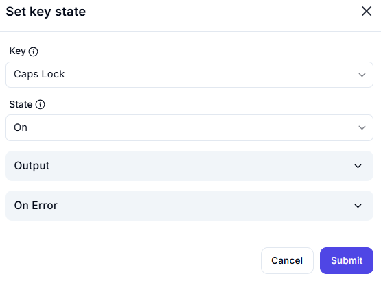

# Set Key State  

## Description

This feature allows users to set the state of a specific key, such as Caps Lock, Num Lock, or Scroll Lock. It is useful for controlling keyboard states during automation workflows.  

  

## Fields and Options  

### 1. **Key** 🛈

- **Description**: Select the key whose state will be set:  
  - **Caps Lock**: Set the state of the Caps Lock key.  
  - **Num Lock**: Set the state of the Num Lock key.  
  - **Scroll Lock**: Set the state of the Scroll Lock key.  
- **Purpose**: This ensures the correct key is targeted for state change.  

### 2. **State** 🛈

- **Description**: Choose the state to set for the selected key:  
  - **On**: Turn the key state on.  
  - **Off**: Turn the key state off.  
- **Purpose**: This ensures the desired state is applied to the key.  

### 3. **Output** 🛈

- **Description**: Retrieve the result of the key state change (if applicable).  
- **Purpose**: This provides feedback or results for further use in the workflow.  

### 4. **On Error**

- **Description**: Define how errors should be handled during execution (e.g., fail, retry, ignore).  
- **Purpose**: This ensures proper error handling in case the key state change fails.

## Use Cases

- **Keyboard State Control**: Turning Caps Lock, Num Lock, or Scroll Lock on or off.  
- **Workflow Preparation**: Setting keyboard states before performing specific tasks.  
- **Error Prevention**: Ensuring the correct keyboard state for applications that depend on it.  

## Summary

The **Set Key State** action provides a way to control the state of specific keys, such as Caps Lock, Num Lock, or Scroll Lock. It ensures accurate keyboard state management, making it ideal for automation workflows that require specific key states.
