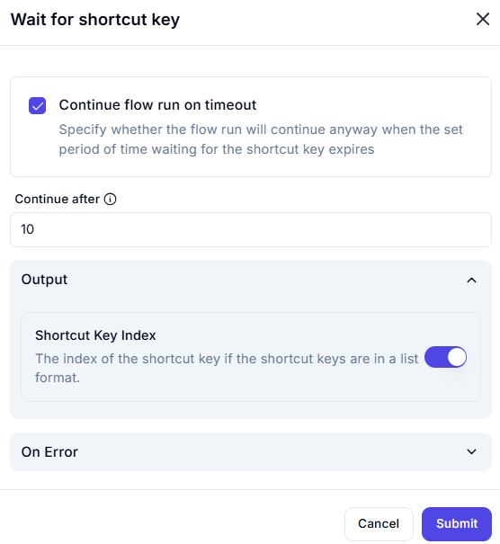

# Wait for Shortcut Key  

## Description

This feature allows users to wait for a specific shortcut key to be pressed. It includes options to continue the flow run after a timeout and retrieve the index of the shortcut key if applicable.  

  

## Fields and Options  

### 1. **Continue Flow Run on Timeout** 🛈

- **Description**: Specify whether the flow run should continue if the shortcut key is not pressed within the set time period:  
  - **Enabled**: Continue the flow run after the timeout expires.  
  - **Disabled**: Stop the flow run if the shortcut key is not pressed within the timeout.  
- **Purpose**: This ensures the flow behaves as expected based on the workflow requirements.  

### 2. **Continue After** 🛈

- **Description**: Set the maximum time (in seconds) to wait for the shortcut key to be pressed (e.g., `10` seconds).  
- **Purpose**: This ensures the flow does not wait indefinitely for the shortcut key.  

### 3. **Output: Shortcut Key Index** 🛈

- **Description**: Retrieves the index of the shortcut key if the shortcut keys are in a list format.  
- **Purpose**: This provides the index of the pressed shortcut key for further use in the workflow.  

### 4. **On Error**

- **Description**: Define how errors should be handled during execution (e.g., fail, retry, ignore).  
- **Purpose**: This ensures proper error handling in case the shortcut key is not pressed or an error occurs.  

## Use Cases

- **User Interaction**: Waiting for a specific shortcut key to be pressed before proceeding with the workflow.  
- **Timeout Handling**: Continuing the flow run after a timeout if the shortcut key is not pressed.  
- **Shortcut Key Indexing**: Retrieving the index of the pressed shortcut key for further processing.  

## Summary

The **Wait for Shortcut Key** action provides a way to wait for a specific shortcut key to be pressed, with options to handle timeouts and retrieve the shortcut key index. It ensures synchronization with user interactions and flexible workflow behavior, making it ideal for automation tasks involving shortcut keys.
