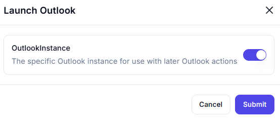

# Launch Outlook  

## Description

This feature allows users to launch Microsoft Outlook and retrieve the instance for use in subsequent actions. It is useful for automating tasks involving emails, calendars, or other Outlook features.  

## Fields and Options  

### 1. **OutlookInstance** 🛈

- **Description**: Retrieves the specific Outlook instance that this action has launched.  
- **Purpose**: This allows the launched Outlook instance to be used in later Outlook actions.

## Use Cases

- **Email Automation**: Launching Outlook to automate email-related tasks.  
- **Calendar Management**: Using Outlook to manage calendars or appointments.  
- **Workflow Integration**: Integrating Outlook into larger automation workflows.  

## Summary

The **Launch Outlook** action provides a way to launch Microsoft Outlook and retrieve the instance for use in subsequent actions. It ensures seamless integration of Outlook into automation workflows, enabling efficient email and calendar management.
