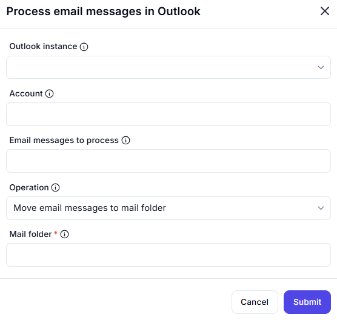

# Process Email Messages in Outlook  

## Description

This feature allows users to process email messages in Outlook, such as moving them to a specified mail folder. It is useful for automating email organization and management tasks.  

  

## Fields and Options  

### 1. **Outlook Instance** 🛈

- **Description**: Select the Outlook instance where the email messages are located.  
- **Purpose**: This ensures the action is performed on the correct Outlook instance.  

### 2. **Account** 🛈

- **Description**: Specify the email account from which to process messages.  
- **Purpose**: This ensures the correct email account is targeted.  

### 3. **Email Messages to Process** 🛈

- **Description**: Select the email messages to process (e.g., specific emails, filtered emails).  
- **Purpose**: This ensures the correct emails are processed.  

### 4. **Operation** 🛈

- **Description**: Choose the operation to perform on the selected email messages:  
  - **Move Email Messages to Mail Folder**: Move the emails to a specified folder.  
- **Purpose**: This ensures the desired operation is performed on the emails.  

### 5. **Mail Folder** 🛈

- **Description**: Specify the mail folder where the emails will be moved (e.g., Inbox, Archive).  
- **Purpose**: This ensures the emails are moved to the correct folder.

## Use Cases

- **Email Organization**: Moving emails to specific folders for better organization.  
- **Automated Email Management**: Automating tasks like archiving or categorizing emails.  
- **Workflow Integration**: Integrating email processing into larger automation workflows.  

## Summary

The **Process Email Messages in Outlook** action provides a way to process email messages, such as moving them to a specified folder. It ensures efficient email organization and management, making it ideal for automation workflows involving Outlook.
