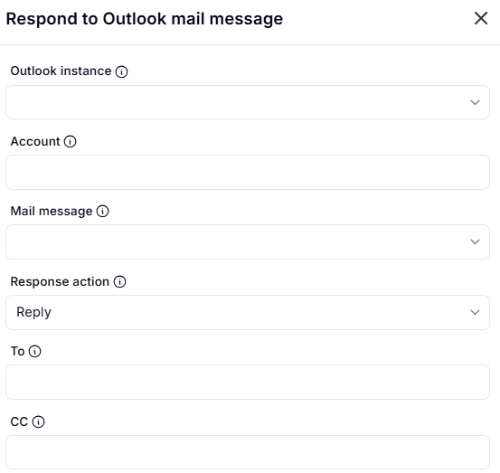
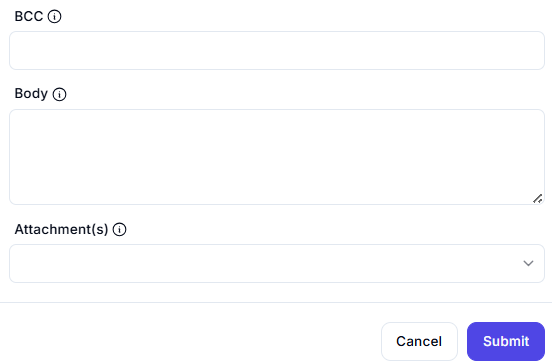

# Respond to Outlook Mail Message  

## Description

This feature allows users to respond to an Outlook email message, such as replying or forwarding it. It is useful for automating email responses and communication tasks.  

## Fields and Options  

### 1. **Outlook Instance** 🛈

- **Description**: Select the Outlook instance where the email message is located.  
- **Purpose**: This ensures the action is performed on the correct Outlook instance.  

### 2. **Account** 🛈

- **Description**: Specify the email account from which to send the response.  
- **Purpose**: This ensures the correct email account is used.  

### 3. **Mail Message** 🛈

- **Description**: Select the email message to respond to.  
- **Purpose**: This ensures the correct email is targeted for the response.  

### 4. **Response Action** 🛈

- **Description**: Choose the type of response to send:  
  - **Reply**: Reply to the sender.  
  - **Reply All**: Reply to the sender and all recipients.  
  - **Forward**: Forward the email to another recipient.  
- **Purpose**: This ensures the desired response action is performed.  

### 5. **To** 🛈

- **Description**: Specify the recipient(s) for the response (if applicable).  
- **Purpose**: This ensures the response is sent to the correct recipient(s).  

### 6. **CC** 🛈

- **Description**: Specify additional recipients to CC on the response (if applicable).  
- **Purpose**: This ensures the response is copied to the desired recipients.

### 7. **CC** 🛈

- **Description**: Specify additional recipients to CC on the response (if applicable).  
- **Purpose**: This ensures the response is copied to the desired recipients.

### 8. **BCC** 🛈

- **Description**: Specify additional recipients to CC on the response (if applicable).  
- **Purpose**: This ensures the response is copied to the desired recipients.

### 9. **Attachment(s)** 🛈

- **Description**: Specify additional recipients to CC on the response (if applicable).  
- **Purpose**: This ensures the response is copied to the desired recipients.

## Use Cases

- **Automated Email Responses**: Automating replies or forwards to incoming emails.  
- **Workflow Integration**: Integrating email responses into larger automation workflows.  
- **Communication Automation**: Streamlining email communication tasks.  

## Summary

The **Respond to Outlook Mail Message** action provides a way to respond to Outlook emails, such as replying or forwarding them. It ensures efficient email communication and integration into automation workflows.
