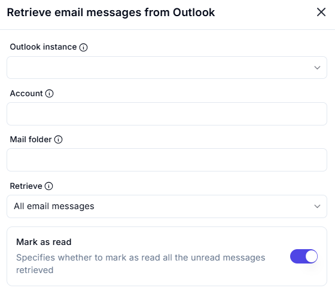
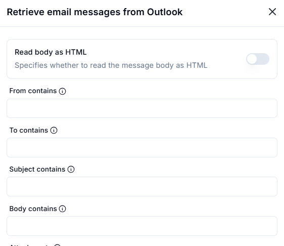
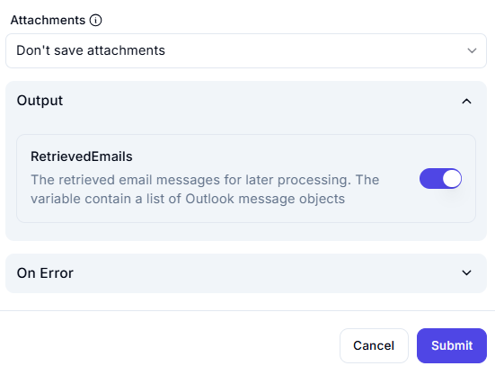

# Retrieve Email Messages from Outlook  

## Description

This feature allows users to retrieve email messages from a specified Outlook account and folder. It includes options to retrieve all email messages and mark them as read.  

## Fields and Options  

### 1. **Outlook Instance** 🛈

- **Description**: Select the Outlook instance from which to retrieve email messages.  
- **Purpose**: This ensures the action is performed on the correct Outlook instance.  

### 2. **Account** 🛈

- **Description**: Specify the email account from which to retrieve messages.  
- **Purpose**: This ensures the correct email account is targeted.  

### 3. **Mail Folder** 🛈

- **Description**: Select the folder (e.g., Inbox, Sent Items) from which to retrieve messages.  
- **Purpose**: This ensures the correct folder is used for retrieving emails.  

### 4. **Retrieve** 🛈

- **Description**: Choose what to retrieve:  
  - **All Email Messages**: Retrieve all email messages from the specified folder.  
- **Purpose**: This ensures the desired scope of email retrieval is applied.  

### 5. **Mark as Read** 🛈

- **Description**: Specify whether to mark as read all the unread messages retrieved:  
  - **Enabled**: Mark retrieved unread messages as read.  
  - **Disabled**: Leave the messages in their original read/unread state.  
- **Purpose**: This controls the read status of the retrieved messages.

### 6. **Read Body as HTML** 🛈

- **Description**: Specify whether to read the message body as HTML:  
  - **Enabled**: Retrieve the message body in HTML format for better formatting.  
  - **Disabled**: Retrieve the message body as plain text.  
- **Purpose**: This ensures the message body is retrieved in the desired format.  

### 7. **From Contains** 🛈

- **Description**: Filter emails based on the sender's email address or name.  
- **Purpose**: This ensures only emails from specific senders are retrieved.  

### 8. **To Contains** 🛈

- **Description**: Filter emails based on the recipient's email address or name.  
- **Purpose**: This ensures only emails sent to specific recipients are retrieved.  

### 9. **Subject Contains** 🛈

- **Description**: Filter emails based on keywords in the subject line.  
- **Purpose**: This ensures only emails with specific subjects are retrieved.  

### 10. **Body Contains** 🛈

- **Description**: Filter emails based on keywords in the message body.  
- **Purpose**: This ensures only emails containing specific content in the body are retrieved.

### 11. **Attachments** 🛈

- **Description**: Choose how to handle email attachments:  
  - **Don't Save Attachments**: Do not save any attachments from the retrieved emails.  
  - **Save Attachments**: Save attachments to a specified location (if applicable).  
- **Purpose**: This ensures attachments are handled according to the workflow requirements.  

### 12. **Output: RetrievedEmails** 🛈

- **Description**: Retrieves the list of Outlook message objects containing the retrieved email messages.  
- **Purpose**: This allows the retrieved emails to be used for further processing in the workflow. 

## Use Cases

- **Email Processing**: Retrieving emails for further processing or analysis.  
- **Automated Email Handling**: Automating tasks like marking emails as read or moving them to specific folders.  
- **Workflow Integration**: Integrating email retrieval into larger automation workflows.

## Summary

The **Retrieve Email Messages from Outlook** action provides a way to retrieve email messages from a specified Outlook account and folder, with options to mark them as read. It ensures efficient email handling and integration into automation workflows.
 